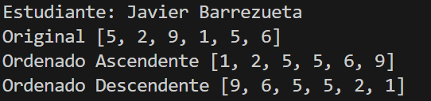
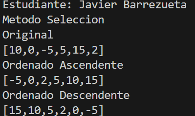

# Estructura de Datos

**Estudiante:** Javier Barrezueta

## Metodos Orednamiento

### Practica 1 - 20/OCT
Metodo Sort Bubble

### Practica 2 - 21/OCT
Metodo Sort Selection en Java y Python

Salida de Python
 

Salida de Java

